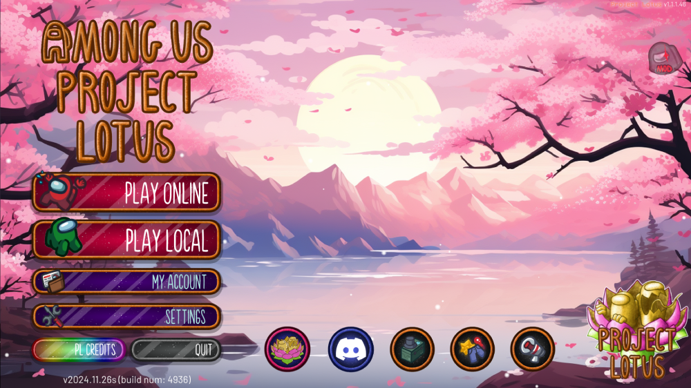

  

<h1 align="center">Project: Lotus</h1>

<h2 align="center"> <a href="https://discord.gg/projectlotus">Discord Server</a> | <a href="https://lotusau.top/rd/install">Install Guide</a> | <a href="https://lotusau.top/">Website</a> | <a href="https://github.com/Lotus-AU/LotusContinued/releases/latest">Download The Latest Release!</a></h2>

<h3 align="center">This is a continuation of the <a href="https://github.com/ImaMapleTree/Lotus">original Project Lotus mod</a> due to the original creator passing the project. </h3>
<i align="center">This mod is not affiliated with Among Us or Innersloth LLC, and the content contained therein is not endorsed or otherwise sponsored by Innersloth LLC. Portions of the materials contained herein are the property of Innersloth LLC.</i>

---
|                    |
| :----------------------------------------------------------------:   |
| <u>**A screenshot of the Main Menu of Project: Lotus. (v1.1.1)**</u> |

---

## Regarding This Mod

#### ⭐Please consider starring our repo if you enjoy the mod!⭐

This Mod only needs to be installed on the **Host**, which needs to be on a PC. Once the mod is installed, anyone on any device may join the lobby to enjoy the mod.  

- Anyone with a PC may also install the mod to join the **Host** to unlock extra features (See Below), but this is not required.
- Please note though, that if the **Host** of the modded lobby leaves, the modded lobby will end and the game will go back to being vanilla. This is the case unless another modded player becomes **Host** of the lobby.

#### Benefits Of Being A Modded Client. 

- Custom start screen displaying your Role's name and what to do.
- Custom victory screen reflecting the Role's unique win condition.
- Custom GUIs.
- Usable Hotkeys.
- Custom Cosmetics with the [**LotusCosmetics**](https://lotusau.top/en/features/cosmetics) addon!
- Better compatability.

---

# Table of Contents.

> **Note:** Links marked with an **`↗`** lead to our Website, [**lotusau.top**](https://lotusau.top).  

> [**Click here to get taken to the roles!**](https://lotusau.top/en/roles)
>
> - [**General Options**](https://lotusau.top/rd/options)
> - [**Commands/Hotkeys**](https://lotusau.top/rd/commands)
> - [**Mod Credits**](https://lotusau.top/credits)
> - [**Online Template Maker**](https://lotusau.top/templates)
> - [**Online YAML Editor**](https://lotusau.top/yaml-editor)
> - [**Modded Lobby Viewer**](https://lotusau.top/lobbies)

| [Welcome to Project: Lotus!](https://lotusau.top/rd/start)                  | [Features of This Mod.](https://lotusau.top/rd/options) | [Frequently Asked Questions](#frequently-asked-questions)      |
|:----------------------------------------------------------------------------|-----------------------------------------------------------| :------------------------------------------------------------: |
| [**Converting from other mods** ↗](https://lotusau.top/rd/convert)         | [Commands ↗](https://lotusau.top/rd/commands)           | [Can I get this mod on Mobile?](#can-i-get-this-mod-on-mobile) |
| [Installing the mod! ↗](https://lotusau.top/rd/install)                    | [Templates ↗](https://lotusau.top/rd/templates)         | [How do I update the mod?](#what-do-the-different-things-in-the-releases-mean--how-do-i-update-the-mod) |
| [Setting up your First Templates. ↗](https://lotusau.top/rd/ftemplates)    | [Custom Cosmetics ↗](https://lotusau.top/rd/cosmetics)  | [Why aren't people joining my lobby when I make it public?](#how-can-i-make-my-lobby-public--why-arent-people-joining-my-lobby) |
| [Making your first Title! ↗](https://lotusau.top/rd/ftitle)                | [User Titles ↗](https://lotusau.top/rd/titles)          | [Why do I get randomly kicked?](#why-do-i-get-randomly-kicked) |
| [Setting up your Settings. ↗](https://lotusau.top/rd/settings)             | [Custom Friend System ↗](https://lotusau.top/rd/friends)| [Why do I get blackscreened?](#why-do-i-keep-getting-black-screened) |

---

# Frequently Asked Questions

## How do I install the mod?
**Please view our installation video below, or [click here for a text guide.](https://lotusau.top/rd/install)**

### Can I <u>download</u> this mod on Mobile?
As of right now, **no.** 
> The people at **All Of Us: AU Mods** are working on an Android Mod launcher, Project: Lotus will be compatible with it at launch, and this will be updated when more information is available.

## What do the different things in the releases mean? / How do I update the mod?
Here's a Quick Explanation -
- **HatUpdate.zip** means there was new Custom Hats added to the mod, these go in your `AmongUs/BepInEx/plugins` folder and will replace the `lotushats.bundle` and `lotushats.catalog` files.

- **Lotus.dll & VentFrameworkContinued.dll** mean there was an update to the mod itself, these go into your `AmongUs/BepInEx/plugins` folder and will replace the previous ones.
  - Note, **VentFrameworkContinued** is required, but a new release may not include it, this means that the previous version can still be used.
  - If either of these are not included in the release, that means there was a mod-breaking update, and you need to install the `Lotus[Version]-[Platform].zip` update. Please make sure to install the correct platform that you are on.

- **lang_[Language].yaml** or **TranslationUpdate.zip** means that there was an update to the mod's translations, these files will go into `AmongUs/Languages/Lotus`

- **Lotus-[Version]-MicrosoftStoreOnly.zip & Lotus-[Version]-Steam+Epic.zip** are included in every release, these are the files to install the mod if you haven't already. 
  - Occasionally a release may not have a .dll file, which means you'll need to download one of these & [reinstall](#how-do-i-install-the-mod) the mod.

### Updating when there's no .dll file.
- Back up your `AmongUs/BepInEx/config` folder, as that's where your settings are stored. Also back up your `LOTUS_DATA` folder if you've made any changes to your Templates, or have given people titles.
- Once those are backed up, delete the `BepInEx` and `dotnet` folders, and reinstall the mod by installing the [Latest Release](https://github.com/Lotus-AU/LotusContinued/releases/latest). Then copy the contents of the **.zip** file into your `Among Us` folder. You can then restore the backed up stuff.
- <u><b>If there was an Among Us Update & Your modded files are separated from your Vanilla files, you'll want to copy your Vanilla files into your Modded folder to update your game.</b></u>

## How can I make my lobby public / Why aren't people joining my lobby?
Vanilla (Non-Modded) players are unable to see your lobby in the in-game matchmaker as of June 2023.
- This was due to a change Innersloth did to their anti-cheat, but Host-Only mods got caught in the crossfire.

#### What can I do then?
We have a bot in our Discord, [**Lilypad**](https://lotusau.top/en/lilypad), which will automatically post your lobby in a channel once it is made public.
You can also view Active Public Lobbies in [**our lobby viewer.**](https://lotusau.top/lobbies/)

Nothing else can be done, as Innersloth needs to make the change.

## Why do I get randomly kicked?
As of April 4th, 2025: Innersloth, the developers of Among Us, have made changes to their server-side anti-cheat which may cause players to be kicked. 
- Please try to report any instances of this happening in our [Discord Server](https://discord.gg/projectlotus)
- If you're constantly being kicked, then try using [Modded Regions](https://lotusau.top/regions), as these regions are not subjected to the same changes.

## Why do I keep getting black-screened?
The cause of this is usually ping. We do a lot to try to prevent blackscreens but in the end they may sometimes happen.
- You may fix blackscreens by telling the host of the lobby to use the `/fix` command on you.
  - Usage: (If you blackscreen on game start): `/fix (player_id) start` | (If you blackscreen after meeting): `/fix (player_id)`
  - (Player ID's can be obtained with the `/ids` command.)
---
# Legal Stuff
### License
This mod is licenced under the **GNU General Public License v3**, you may read it [**here.**](https://github.com/Lotus-AU/LotusContinued/blob/main/LICENSE)

### Privacy Policy
Project Lotus has a few optional features that require sharing data with our API. Like bug reports and lobby information. Check our [Privacy Policy](https://lotusau.top/privacy#lotus) for more details. These can be disabled, and do not affect core gameplay in any way.

---
       

thank you for using this mod, & lotus forever 🪷
